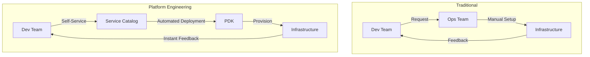
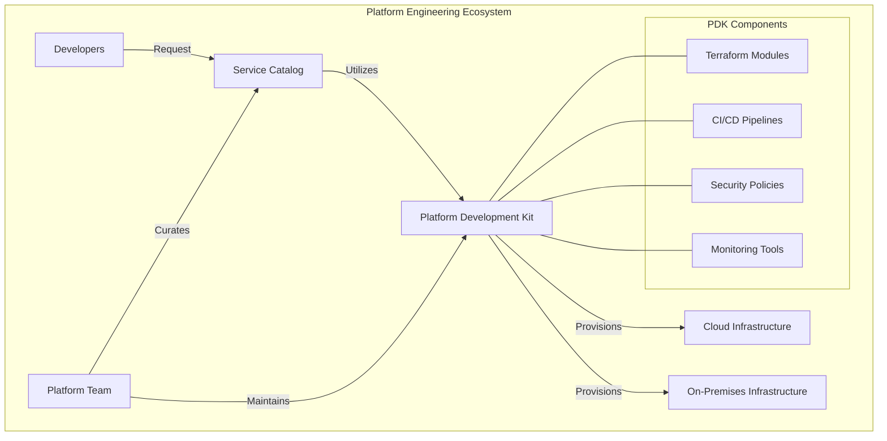
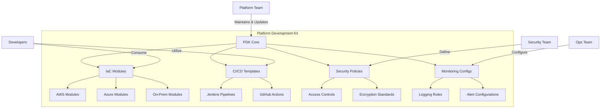
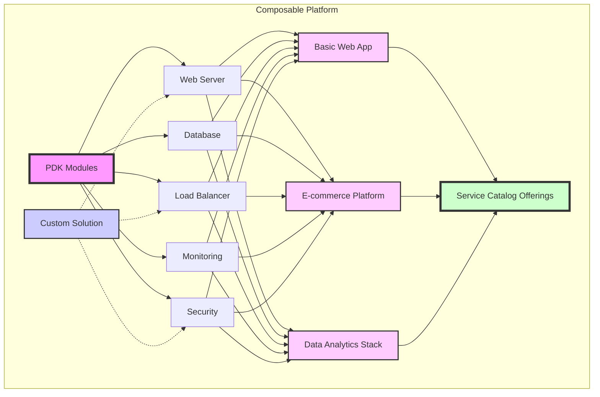
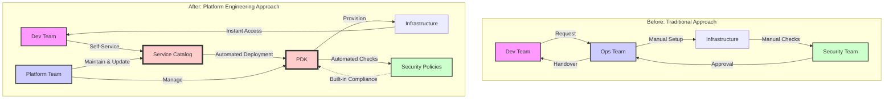

Here's the compilation of all the slides with their content and diagram code:

Slide 1: Title Slide (30 seconds)
Title: "Platform Engineering: A Strategic Approach to Infrastructure Management"
Subtitle: "Empowering Innovation with PDK and Service Catalog"
Presenter's Name: [Your Name]
Date: [Current Date]

Slide 2: Introduction (2 minutes)
Title: "The Infrastructure Challenge"

- Diverse and complex IT landscapes
  - Multiple cloud providers (AWS, Azure, etc.)
  - On-premises data centers
  - Hybrid and multi-cloud environments
- Challenges:
  - Inconsistent deployment practices
  - Lengthy provisioning times
  - Difficulty maintaining standards
  - Increased operational overhead
  - Security and compliance risks
- The need for a strategic approach:
  - Standardization across environments
  - Automation and self-service capabilities
  - Improved governance and control

Slide 3: Traditional vs. Platform Engineering Approach (4 minutes)
Title: "Traditional vs. Platform Engineering Approach"

1. Traditional Approach:
   - Siloed teams and processes
   - Manual, ticket-based workflows
   - Inconsistent practices across projects
   - Slow provisioning and deployment

2. Platform Engineering Approach:
   - Centralized, reusable components (PDK)
   - Self-service capabilities (Service Catalog)
   - Standardized, automated workflows
   - Rapid provisioning and deployment

3. Benefits of Platform Engineering:
   - Increased developer productivity
   - Improved consistency and reliability
   - Enhanced security and compliance
   - Faster time-to-market
   - Better resource utilization



Slide 4: Platform Engineering: Key Components (3 minutes)
Title: "Platform Engineering: Key Components"

1. Platform Development Kit (PDK):
   - Reusable infrastructure-as-code modules
   - Standardized tooling and practices
   - Built-in best practices and compliance

2. Service Catalog:
   - Self-service interface for developers
   - Pre-approved, standardized offerings
   - Simplified access to complex infrastructure

3. Interaction between PDK and Service Catalog:
   - Service Catalog leverages PDK components
   - PDK ensures consistency across offerings
   - Enables rapid, compliant deployments



Slide 5: Platform Development Kit (PDK) Deep Dive (4 minutes)
Title: "Platform Development Kit (PDK): The Engine of Platform Engineering"

1. Definition and Scope:
   - Collection of reusable, modular components
   - Standardized tooling and practices
   - Covers multiple infrastructure types (cloud, on-prem)

2. Key Components:
   - Infrastructure-as-Code modules (e.g., Terraform)
   - CI/CD pipeline templates
   - Security and compliance policies
   - Monitoring and logging configurations

3. Design Principles:
   - Modularity and composability
   - Consistency across environments
   - Built-in best practices and governance

4. Strategic Benefits:
   - Accelerated development and deployment
   - Reduced errors and improved reliability
   - Enhanced security and compliance posture
   - Easier adoption of new technologies



Slide 6: Service Catalog: Simplifying Complexity (4 minutes)
Title: "Service Catalog: Simplifying Complexity"

1. Purpose and Target Audience:
   - Self-service portal for developers and teams
   - Curated set of pre-approved infrastructure offerings
   - Designed for ease of use and rapid deployment

2. How it Leverages PDK:
   - Built on top of PDK components
   - Abstracts complexity of underlying infrastructure
   - Ensures consistency with organizational standards

3. Types of Offerings:
   - Infrastructure templates (e.g., web app environments, databases)
   - Managed services (e.g., monitoring, logging, security scans)
   - DevOps tools and pipelines

4. Strategic Advantages for Application Teams:
   - Accelerated provisioning and time-to-market
   - Reduced cognitive load and decision fatigue
   - Automatic compliance with organizational policies
   - Standardization without sacrificing flexibility

```
+----------------------------------+
|        Service Catalog           |
|  +----------------------------+  |
|  |     Curated Offerings      |  |
|  |  +-----------------------+ |  |
|  |  |   Web App Template    | |  |
|  |  +-----------------------+ |  |
|  |  +-----------------------+ |  |
|  |  |   Database Cluster    | |  |
|  |  +-----------------------+ |  |
|  |  +-----------------------+ |  |
|  |  |    CI/CD Pipeline     | |  |
|  |  +-----------------------+ |  |
|  +----------------------------+  |
|               |                  |
|               v                  |
|  +----------------------------+  |
|  |    Platform Dev Kit (PDK)  |  |
|  |  +-----------------------+ |  |
|  |  |   IaC Modules         | |  |
|  |  +-----------------------+ |  |
|  |  +-----------------------+ |  |
|  |  |   Security Policies   | |  |
|  |  +-----------------------+ |  |
|  |  +-----------------------+ |  |
|  |  |   Monitoring Configs  | |  |
|  |  +-----------------------+ |  |
|  +----------------------------+  |
+----------------------------------+
```

Slide 7: Composability: The Power of Modularity (4 minutes)
Title: "Composability: The Power of Modularity"

1. Definition of Composability:
   - Building complex systems from smaller, reusable components
   - Flexibility to combine and reconfigure modules as needed

2. Composability in Platform Engineering:
   - PDK modules as building blocks
   - Service Catalog offerings as pre-composed solutions

3. Strategic Benefits of a Composable Approach:
   - Increased flexibility and adaptability
   - Faster innovation and experimentation
   - Easier maintenance and updates
   - Scalability across different environments

4. Real-world Application:
   - Customizing standard offerings for specific needs
   - Rapidly creating new offerings from existing components



Slide 8: Transforming Infrastructure Management (4 minutes)
Title: "Transforming Infrastructure Management"

1. How PDK and Service Catalog Change the Game:
   - From manual, error-prone processes to automated, consistent deployments
   - From lengthy approval cycles to governed self-service
   - From siloed knowledge to shared, reusable components

2. Empowering Developers:
   - Self-service access to complex infrastructure
   - Focus on application development, not infrastructure management
   - Faster experimentation and innovation

3. Reducing Operational Overhead:
   - Standardized, repeatable processes
   - Automated compliance and security checks
   - Centralized management and updates

4. Bridging the Gap Between Dev and Ops:
   - Shared language and tools
   - Clearer responsibilities and handoffs
   - Improved collaboration and knowledge sharing



Slide 9: Strategic Advantages for the Organization (3 minutes)
Title: "Strategic Advantages of Platform Engineering"

1. Improved Agility and Time-to-Market:
   - Faster provisioning and deployment
   - Reduced time from idea to production

2. Enhanced Standardization and Governance:
   - Consistent infrastructure across environments
   - Built-in compliance and security controls

3. Cost Optimization and Resource Efficiency:
   - Better resource utilization
   - Reduced manual effort and operational costs

4. Innovation Enablement:
   - Faster experimentation and prototyping
   - Easier adoption of new technologies

5. Risk Reduction:
   - Decreased human error
   - Improved disaster recovery capabilities

```
+--------------------------------------------------+
|        Strategic Advantages of Platform          |
|                  Engineering                     |
|                                                  |
| +----------------+  +---------------------------+|
| |   AGILITY      |  |      STANDARDIZATION      ||
| |  🚀 +120%      |  |        & GOVERNANCE       ||
| | Faster Time    |  |     🔒 100% Compliance    ||
| | to Production  |  |    with Security Policies ||
| +----------------+  +---------------------------+|
|                                                  |
| +----------------+  +---------------------------+|
| |     COST       |  |       INNOVATION          ||
| | OPTIMIZATION   |  |                           ||
| |  💰 -30%       |  |   🧪 5x Increase in       ||
| |  Operational   |  |     Experimentation       ||
| |    Costs       |  |                           ||
| +----------------+  +---------------------------+|
|                                                  |
| +------------------------------------------+     |
| |              RISK REDUCTION              |     |
| |    🛡️ 90% Decrease in Configuration     |     |
| |             Related Incidents            |     |
| +------------------------------------------+     |
+--------------------------------------------------+
```

Slide 10: Key Takeaways (1.5 minutes)
Title: "Key Takeaways: The Power of Platform Engineering"

1. Transformative Approach:
   - Shifts from manual, siloed processes to automated, integrated workflows

2. Empowerment through Self-Service:
   - Developers gain controlled access to complex infrastructure

3. Standardization with Flexibility:
   - Consistent practices across environments without sacrificing adaptability

4. Enhanced Security and Compliance:
   - Built-in controls and automated checks

5. Accelerated Innovation:
   - Faster experimentation and easier adoption of new technologies

6. Strategic Value:
   - Improved agility, cost efficiency, and risk reduction

```
+--------------------------------------------------+
|        Platform Engineering: Key Takeaways       |
|                                                  |
|  🔄 Transformative  |  🛠️ Self-Service           |
|     Approach       |     Empowerment             |
|                    |                             |
|  🧩 Standardization |  🔒 Enhanced Security       |
|    with Flexibility|     and Compliance          |
|                    |                             |
|  🚀 Accelerated     |  💼 Strategic Value         |
|     Innovation     |     for the Organization    |
|                    |                             |
+--------------------------------------------------+
```
